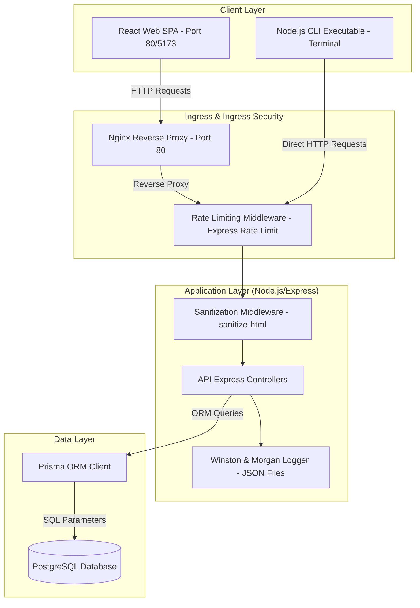
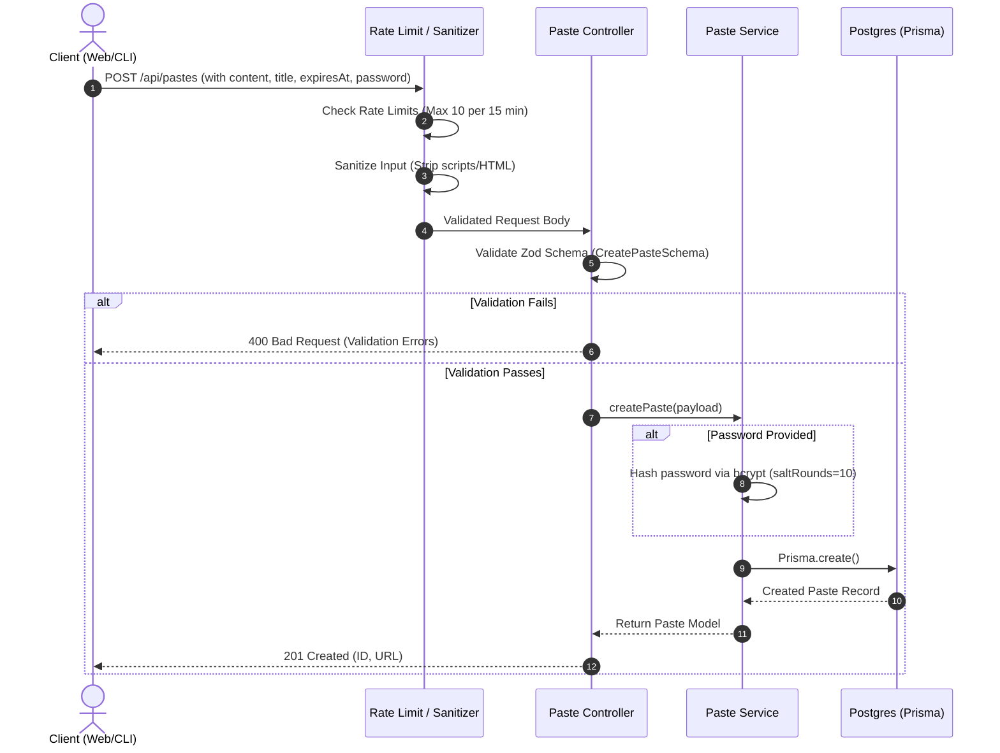
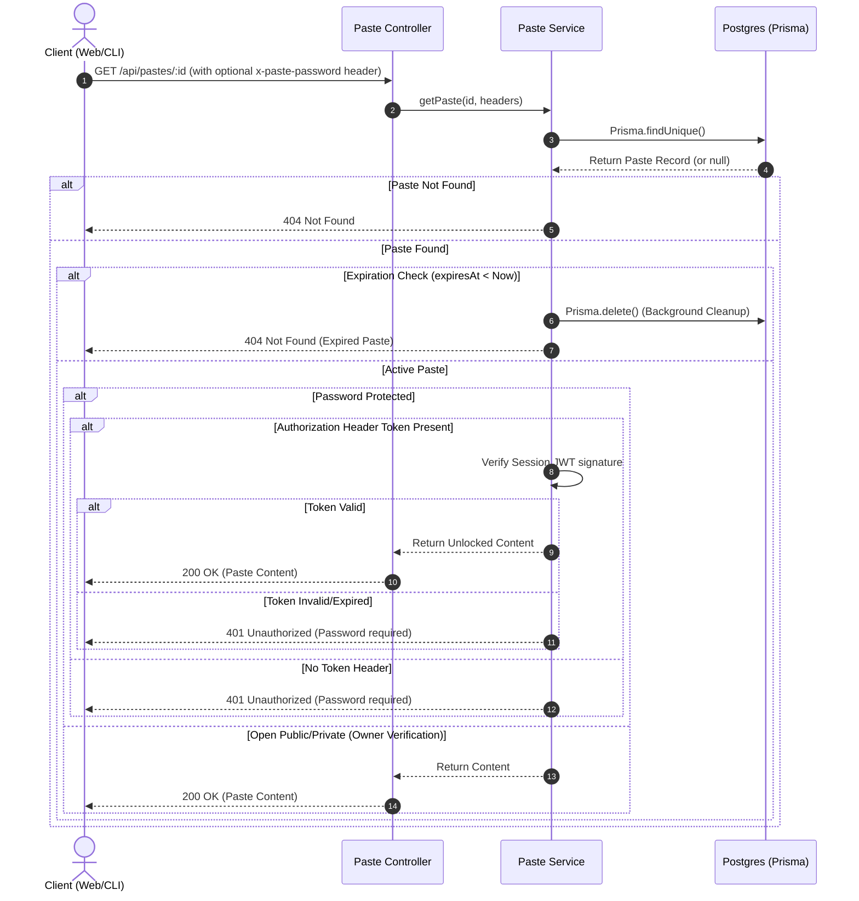
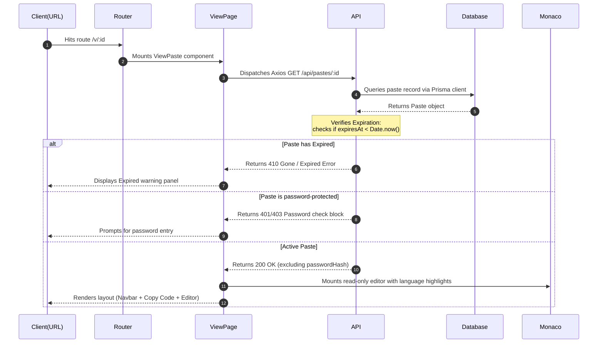

# System Architecture - PasteBin

## 1. Tech Stack Overview
- **Monorepo Manager**: npm Workspaces
- **Frontend**: React, Vite, Tailwind CSS, Axios, Lucide React
- **Backend**: Node.js, Express, TypeScript, Morgan, Helmet, Cors
- **Database / ORM**: PostgreSQL, Prisma ORM
- **Shared Utilities**: TypeScript, Zod

## 2. Directory Layout & Monorepo Structure

```
pastebin/
├── apps/
│   ├── web/             # React + Vite Frontend Client
│   ├── server/          # Node.js + Express API Backend Server
│   └── cli/             # Commander-based Node.js Terminal Developer Client
├── packages/
│   ├── database/        # Prisma Schema, Migrations, Client Export
│   └── shared/          # TypeScript shared interfaces, Zod validation schemas
├── docker/              # Multi-stage Docker config files
├── scripts/             # Production deployment and automation scripts
└── docs/                # Project manuals and decisions logs
```

## 3. Comprehensive System Architecture Diagram


## 4. Folder Philosophy & Workspaces Code Sharing
Workspaces are linked at the root level using npm workspaces. Code sharing follows these rules:
- All interfaces, validation schemas (Zod), and helper utils shared between client and server are placed in `packages/shared`.
- Database models and Client exports reside in `packages/database`.
- Apps depend on packages through package dependencies declared in their respective `package.json` configurations (e.g. `"@pastebin/shared": "*"`).

---

## 5. Backend Layered Architecture

The Express server follows a structured, layered architectural pattern separating routing, request handling, business logic, and database operations:

```
apps/server/src/
├── index.ts               # Bootstraps Express applications, configurations and middleware
├── routes/
│   └── paste.routes.ts    # Defines endpoint paths and links them to the Controller
├── controllers/
│   └── paste.controller.ts# Handles HTTP requests, parses headers/parameters, and runs Zod validation
├── services/
│   └── paste.service.ts   # Contains full business logic (bcrypt hashes, queries database client)
└── middleware/
    └── error.middleware.ts# Intercepts thrown exceptions and sends formatted JSON payloads
```

### Flow of Execution
1. **Routing**: `paste.routes.ts` maps request patterns to `PasteController` actions.
2. **Controller**: `paste.controller.ts` validates incoming payloads using schemas imported from `@pastebin/shared` and extracts parameters/headers.
3. **Service**: `paste.service.ts` processes logic (hashing passwords, checking expirations) and runs operations against Prisma.
4. **Repository**: Prisma client under `@pastebin/database` accesses the database, returning models back through the layers.
5. **Error Handler**: Any failure throws an exception which is handled by the global error middleware to keep responses structured.

---

## 6. Request Lifecycle Data Flow

### 1. Create Paste Lifecycle


### 2. Retrieve Paste Lifecycle


---

## 7. Frontend Architecture

The React client located in `apps/web` is built using a modern component-driven architecture:

```
apps/web/src/
├── main.tsx               # Entry point registering global stylesheets
├── App.tsx                # Mounts ThemeProvider, MainLayout, and application views
├── components/
│   ├── theme-provider.tsx # React Context state provider managing Dark/Light modes
│   ├── mode-toggle.tsx    # Dropdown UI trigger to switch themes
│   └── layout/
│       ├── Navbar.tsx     # Sticky header containing navigation items
│       ├── Footer.tsx     # Bottom footer wrapper
│       └── MainLayout.tsx # Layout bounds and responsive grid container
├── lib/
│   └── utils.ts           # Class merger function (cn utility using clsx/tailwind-merge)
└── index.css              # Custom Radix CSS variables and tailwind baseline layers
```

### Components & Styling Core
- **Radix UI Primitives**: Standard accessibility primitives (e.g. DropdownMenu) are used to construct interactive nodes.
- **Tailwind CSS**: Styling is declared inline using Tailwind classes. Theme configurations map colors to CSS variables defined in `index.css`.
- **Theme state (Context)**: A React context (`theme-provider.tsx`) stores theme mode in localStorage and updates root document styles reactively.

---

## 7. Editor & Validation Strategy

### Core Editor Wrapper (`@monaco-editor/react`)
The central code-sharing input utilizes Monaco Editor wrapped as a reusable React component:
- **Properties**: Manages dynamic language targets (e.g. `javascript`, `python`, `rust`) and reads theme bindings (swapping between `vs-dark` and `light` themes dynamically).
- **Execution Mode**: Runs in active edit mode during creation, and shifts to `readOnly: true` format during visualization, preserving tab spacings and line configurations.

### Client-Side Validation (`@pastebin/shared` + Zod)
Validation rules are compiled as Zod schemas under the shared package `@pastebin/shared` and imported directly:
- Prior to POST requests, the client compiles form values and executes `CreatePasteSchema.safeParse(payload)`.
- If schema validation fails, the UI captures parsing error messages and overlays validation banners, preventing invalid REST calls.
- Once client checks pass, Axios dispatches JSON payloads to the Express server, ensuring inputs are validated consistently.

---

## 8. Retrieval Flow

The process of loading and displaying a shared paste code block follows a structured flow across the layers:



---

## 9. Authentication & Security

### Layered Defense & Hardening

The application applies a multi-layered security strategy protecting database inputs, routing paths, and server infrastructure:

1. **Stateless JWT Session Management**:
   - **Registration**: Passwords supplied by users are hashed asynchronously via `bcrypt` with a work factor of 10 (`saltRounds`) before database persistence. No plain-text passwords ever touch the storage layer.
   - **Login**: Upon credentials check validation, the server dispatches a JWT signed with `HS256` containing public user identifiers (`userId`, `email`). The token lifetime is configured to 7 days.
   - **Authorization**: Protected client requests attach the token inside the HTTP header format: `Authorization: Bearer <JWT>`. The server middleware (`authMiddleware`) parses and validates the token authenticity, attaching the verified user payload to the request object.
   - **Client Session Storage**: The Vite client stores the token in `localStorage` and exposes login states via `AuthContext` dynamically updating navbar headers.

2. **Layered API Rate Limiting**:
   - **Global Rate Limiter**: Capped at 100 requests per 15 minutes per IP address to safeguard base server capacity.
   - **Strict Rate Limiter**: Capped at 10 requests per 15 minutes per IP address. Applied to sensitive routes: registration, login, and paste creation endpoints (`/api/auth/*` and `POST /api/pastes`) to prevent spam and brute-force cracking.
   - **Deletion Rate Limiter**: Capped at 5 delete requests per 1 minute per IP address.

3. **HTTP Security Headers & CORS Origins**:
   - **Helmet Middleware**: Configured globally in the Express server to set secure HTTP headers (including HSTS, CSP configuration, and X-Content-Type-Options) to mitigate common web vectors (Clickjacking, XSS, etc.).
   - **CORS Configuration**: Restricts incoming API requests strictly to verified client origins (`http://localhost:5173` and `http://localhost:3000`).
   - **Structured Morgan Logger**: Morgan is configured with a custom token mapping formatting all incoming requests to JSON for downstream log aggregators (Elasticsearch, Loki, etc.) and audit trails.
   - **Input Sanitization**: User emails and passwords are trimmed and normalized at the controller boundary. Parameterized queries executed by Prisma ensure complete mitigation against SQL Injection attacks.

---

## 10. Logging & Monitoring

### Structured Winston Logging
The API server configures a Winston logging interface separating output targets by execution environment:
- **Transports**:
  - **Console Transport**: Enabled for all runs, outputting colorized format lines (`[timestamp] level: message`) for developer debugging.
  - **File Transport**: Production runs write JSON objects containing `level`, `message`, and `timestamp` fields into two file loggers under `/apps/server/logs/`:
    - `error.log`: Captures error-level issues and exception trace logs.
    - `combined.log`: Gathers all events logged at the `info` level and above.
- **Morgan Integration**: Access logs generated by incoming requests are routed through Winston's `http` log level in a structured JSON payload string format. This ensures unified file outputs and lets teams configure standardized syslog forwarders.

### Health Verification Pings
The `/health` route uses dynamic queries to ping Postgres (`db.$queryRaw`SELECT 1``) to verify DB reachability in real-time, responding with `503 Service Unavailable` on connection timeouts. Uptime is computed dynamically using Node's native `process.uptime()`.

---

## 11. Docker Architecture & Containerization

### Multi-stage Building
The monorepo uses multi-stage Docker builds to compile assets and deliver lean, secure runtime environments:
- **Build Isolation (Stage 1)**: Base builder images install devDependencies, resolve monorepo TS dependencies, compile files to JS, and run prisma client generators. This keeps compiler and package resolution concerns completely isolated from production nodes.
- **Production Stripping (Stage 2)**:
  - **Server Image**: Pulls compiled source files and maps ONLY hoisted production-dependencies `node_modules` (via `npm prune --omit=dev`), reducing backend image size. Runs as a non-root `node` system user.
  - **Web Image**: Copies Vite statically compiled frontend assets into a lightweight `nginx:alpine` image. Employs a custom `nginx.conf` routing configuration to direct SPA routes back to the main document entry.

### Production Environment Topology
Services run linked on a private virtual bridge network (`pastebin-prod-network`), isolating database ports from public access. Persistent storage volumes mapping PostgreSQL directories ensure data survives host restarts.

---

## 12. CLI Client Architecture

### Overview
The CLI client (`@pastebin/cli`) provides a command-line interface for developers to upload, retrieve, and inspect code pastes directly from their terminal. It communicates with the same backend REST API as the React Web application, verifying the architectural concept of supporting multiple client types.

### Key Components
- **Command Parser (`commander`)**: Resolves options and maps inputs to designated execution command blocks.
- **REST Integrations (`axios`)**: Handles HTTP requests targeting backend routes `/api/auth` and `/api/pastes`.
- **Config Storage**: Saves user session tokens (JWTs) locally in `~/.pastebin-config.json`. Subsequent paste operations read this config file to automatically inject authentication headers.
- **Output Mappings**: Formats list outputs in standard columns and provides syntax highlighting for retrieved snippets using terminal colors (`chalk`).

---

## 13. Frontend Performance & Accessibility (a11y)

### SPA Code Splitting & Lazy Routing
To maintain low initial load times and optimize Time to Interactive (TTI), the web application enforces lazy loading for page-level components:
- **Dynamic Imports**: React Router routes are mapped to lazy dynamically imported targets (e.g. `const Browse = React.lazy(...)`), dividing the code bundle into smaller chunks loaded on-demand.
- **Suspense Transitions**: Route switchers are wrapped in React `<Suspense>` components with structured skeleton fallback screens, preventing blank display delays.

### Monaco Editor Web Workers CDN Offloading
Monaco Editor contains extensive code parsing and compilation workers. To prevent blocking the main browser thread:
- **CDN Workers**: `@monaco-editor/react` is configured globally at `main.tsx` to fetch editor files asynchronously from optimized public JSDelivr CDNs.
- **Off-thread Compilation**: Heavy syntax verification operations execute in background web workers managed by Monaco, leaving the React application interactive.

### Client-Side Query Caching
To optimize API requests and database queries, the public Browse page implements client-side state caching:
- **In-Memory TTL Caching**: Retains page results mapped by query parameters (page number, search keywords, language filters) with a 30-second TTL.
- **Instant rendering**: Switching back and forth between paste views and browse listings displays cached results instantly without reloading animations or REST server roundtrips.

### Accessibility Hardening
- **ARIA Attributes**: Buttons, selectors, and text fields declare descriptive `aria-label` and `role` fields.
- **Keyboard Navigation**: Focus rings (`focus:ring`) are declared on all form inputs and links to ensure complete keyboard focus indicators are visible.

---

## 14. Production Infrastructure

### Reverse Proxy & Static Assets serving (Nginx)
The frontend web container runs an optimized **Nginx reverse proxy server**:
- **Static Assets Delivery**: Serves optimized React bundles directly from the Nginx filesystem, maximizing speed.
- **Client Routing Redirection**: Incorporates fallback location matching rules in `nginx.conf` (`try_files $uri $uri/ /index.html`) to redirect client-side route queries back to the React entry point, preventing 404 page-load errors on reload.

### Process Management & Supervision
- **Node.js Lifecycle**: The backend server is monitored by the Docker engine using `restart: always` to handle process restarts.
- **Order-dependent startup**: Uses Docker Compose healthchecks (`db` and `server`) ensuring postgres and express are verified healthy before downstream nodes are initialized.

### Database Persistence Strategy
- **Volumes Mapping**: Mounts a Docker persistent volume (`postgres_prod_data` to `/var/lib/postgresql/data`) to prevent data loss across container lifecycle resets.


