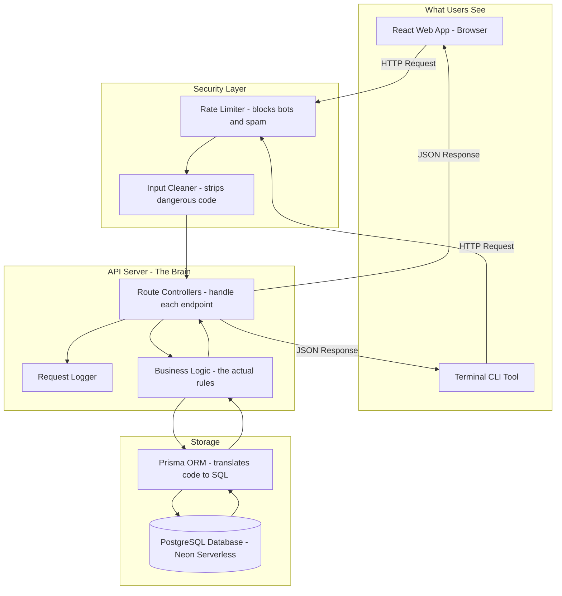

# How PasteBin Is Built — Architecture Guide

> **This document explains how PasteBin works under the hood.**
> You don't need to be a programmer to read Section 1 and 2.
> Section 3 onwards goes into technical detail for developers.

---

## 1. The Big Picture (Plain English)

Think of PasteBin like a digital sticky note board for developers.

When you paste some code and click **"Create Paste"**, here's what actually happens behind the scenes:

```
Your browser
   ↓  sends a request
Security layer (rate limit + input cleaning)
   ↓  checks you're not a bot and cleans the data
The API server (the brain)
   ↓  validates and processes your request
The database (the memory)
   ↓  saves your paste permanently
The API server
   ↓  sends back your paste link
Your browser shows you the result ✅
```

That's it. Every feature in the app follows this exact flow.

---

## 2. The Three Main Parts

PasteBin is split into three separate apps that talk to each other:

| Part                     | What It Is                   | What It Does                                |
| ------------------------ | ---------------------------- | ------------------------------------------- |
| **Website (Frontend)**   | What you see in your browser | The buttons, editor, and pages              |
| **API Server (Backend)** | The brain behind the scenes  | Handles logic, saves data, checks passwords |
| **Database**             | The permanent storage        | Stores all pastes, users, and history       |

There's also a **CLI tool** — a command-line version of the app that developers can use from their terminal instead of a browser.

---

## 3. Tech Stack Overview

These are the technologies used to build each part:

- **Monorepo Structure**: All three apps live in one codebase, managed with npm Workspaces
- **Frontend**: React 19, Vite, Tailwind CSS, Monaco Editor (the same editor as VS Code)
- **Backend**: Node.js, Express, TypeScript, Winston (logging), Helmet (security headers)
- **Database / ORM**: PostgreSQL (the database), Prisma ORM (the bridge between code and database)
- **Shared Utilities**: TypeScript types and Zod validation schemas shared across all packages

---

## 4. Directory Layout

```
pastebin/
├── apps/
│   ├── web/             # React + Vite Frontend (what you see in the browser)
│   ├── server/          # Node.js + Express API Backend (the brain)
│   └── cli/             # Terminal tool for developers
├── packages/
│   ├── database/        # Prisma schema, migrations, database client
│   └── shared/          # Shared TypeScript types and validation schemas
├── scripts/             # Deployment and setup helper scripts
└── docs/                # Project documentation (you are here)
```

---

## 5. Full System Diagram



---

## 6. How Each Feature Works

### Creating a Paste

1. You type code in the Monaco editor and click **Create Paste**
2. The frontend validates basic inputs (title length, content required)
3. A POST request is sent to `/api/pastes` with your data
4. The server sanitizes the title and content (removes dangerous scripts)
5. If a password was set, it's hashed using bcrypt (one-way encryption)
6. A random 8-character uppercase ID is generated (e.g., `AB3XZ72K`)
7. The paste is saved to the PostgreSQL database
8. The server responds with the paste object and your browser redirects to `/v/AB3XZ72K`

### Visibility Levels Explained

| Level       | Who Can See It                            |
| ----------- | ----------------------------------------- |
| **Public**  | Everyone, appears in Browse and Search    |
| **Private** | Only accessible with a password PIN       |
| **Secret**  | Only you (the logged-in owner) can see it |

### Expiration

- **Guest pastes** always expire after 1 hour automatically
- **Logged-in users** can set custom expiration: 1h, 24h, 7d, 30d, or no expiration
- When an expired paste is requested, the server returns `410 Gone` instead of the content

### Authentication Flow

```
Register → password hashed with bcrypt → user saved to DB
Login → password compared with stored hash → JWT token issued (7 days)
Every protected request → JWT verified → user ID extracted → request processed
```

---

## 7. API Route Map

| Method   | Route                   | What It Does                        |
| -------- | ----------------------- | ----------------------------------- |
| `POST`   | `/api/pastes`           | Create a new paste                  |
| `GET`    | `/api/pastes/:id`       | Get a paste by ID                   |
| `PATCH`  | `/api/pastes/:id`       | Edit a paste                        |
| `DELETE` | `/api/pastes/:id`       | Delete a paste                      |
| `GET`    | `/api/pastes`           | Browse public pastes                |
| `GET`    | `/api/pastes/mine`      | Get your own pastes (auth required) |
| `POST`   | `/api/pastes/:id/share` | Share a paste with another user     |
| `POST`   | `/api/auth/register`    | Create a new account                |
| `POST`   | `/api/auth/login`       | Log in and get a token              |
| `GET`    | `/api/users/:username`  | View a user's profile               |
| `PATCH`  | `/api/users/me`         | Update your profile                 |
| `GET`    | `/api/search`           | Search pastes                       |
| `GET`    | `/health`               | Check if the server is alive        |

---

## 8. Security Layers (In Order)

Every incoming request passes through these layers in sequence:

1. **Helmet** — Sets HTTP security headers (prevents clickjacking, MIME sniffing, etc.)
2. **CORS** — Only allows requests from trusted frontend origins
3. **Rate Limiter** — Blocks IPs that send too many requests
4. **Input Sanitizer** — Strips dangerous HTML/script tags from paste content
5. **JWT Middleware** — Verifies the user's login token on protected routes
6. **Zod Validation** — Validates the request body shape before any logic runs
7. **Service Layer** — Applies business rules (ownership checks, expiration checks)
8. **Prisma ORM** — Parameterized queries prevent SQL injection

---

## 9. Database Models

The database has 5 main tables:

| Table        | What It Stores                                                |
| ------------ | ------------------------------------------------------------- |
| `User`       | Account info (email, username, hashed password, bio, avatar)  |
| `Paste`      | The actual paste content, visibility, expiry, and owner       |
| `Share`      | Who has been given access to a paste and with what permission |
| `SavedPaste` | A user's bookmarked pastes                                    |
| `RecentView` | The last 5 pastes a logged-in user viewed                     |

---

## 10. Deployment

- **Frontend**: Deployed on [Render](https://render.com/) as a static site — `https://pastebin-frontend-tfjz.onrender.com`
- **Backend**: Deployed on [Render](https://render.com/) as a Web Service — `https://pastebin-backend-yba9.onrender.com`
- **Database**: Hosted on [Neon](https://neon.tech/) — serverless PostgreSQL, scales to zero when idle
