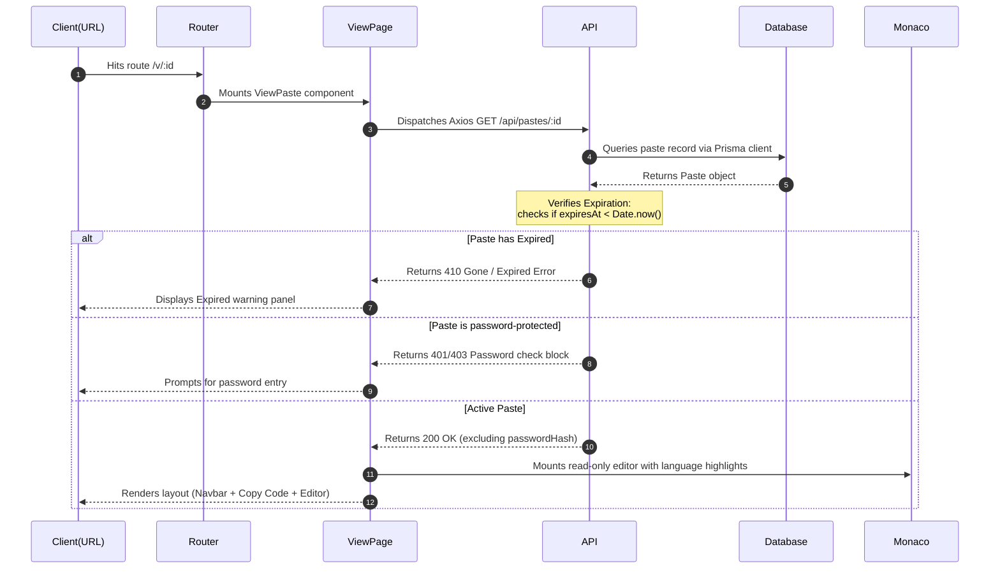

# System Architecture - PasteBin

## 1. Tech Stack Overview
- **Monorepo Manager**: npm Workspaces
- **Frontend**: React, Vite, Tailwind CSS, Axios, Lucide React
- **Backend**: Node.js, Express, TypeScript, Morgan, Helmet, Cors
- **Database / ORM**: PostgreSQL, Prisma ORM
- **Shared Utilities**: TypeScript, Zod

## 2. Directory Layout & Monorepo Structure

```
pastebin/
├── apps/
│   ├── web/             # React + Vite Client (Vite Dev Server)
│   └── server/          # Node.js + Express API Server
├── packages/
│   ├── database/        # Prisma Schema, Migrations, Client Export
│   └── shared/          # TypeScript interfaces, validation schemas, utility functions
├── docker/              # Environment configurations for Docker
├── scripts/             # Infrastructure and deployment automation
└── docs/                # Project design and technical documentation
```

## 3. Communication Flow
```mermaid
graph TD
    Client[apps/web React Client] -->|HTTP Requests| API[apps/server Express API]
    API -->|Prisma Client| DB[(PostgreSQL Database)]
    Shared[@pastebin/shared] -->|Type Import| Client
    Shared -->|Schema / Validation| API
    DBPackages[@pastebin/database] -->|ORM Client| API
```

## 4. Folder Philosophy & Workspaces Code Sharing
Workspaces are linked at the root level using npm workspaces. Code sharing follows these rules:
- All interfaces, validation schemas (Zod), and helper utils shared between client and server are placed in `packages/shared`.
- Database models and Client exports reside in `packages/database`.
- Apps depend on packages through package dependencies declared in their respective `package.json` configurations (e.g. `"@pastebin/shared": "*"`).

---

## 5. Backend Layered Architecture

The Express server follows a structured, layered architectural pattern separating routing, request handling, business logic, and database operations:

```
apps/server/src/
├── index.ts               # Bootstraps Express applications, configurations and middleware
├── routes/
│   └── paste.routes.ts    # Defines endpoint paths and links them to the Controller
├── controllers/
│   └── paste.controller.ts# Handles HTTP requests, parses headers/parameters, and runs Zod validation
├── services/
│   └── paste.service.ts   # Contains full business logic (bcrypt hashes, queries database client)
└── middleware/
    └── error.middleware.ts# Intercepts thrown exceptions and sends formatted JSON payloads
```

### Flow of Execution
1. **Routing**: `paste.routes.ts` maps request patterns to `PasteController` actions.
2. **Controller**: `paste.controller.ts` validates incoming payloads using schemas imported from `@pastebin/shared` and extracts parameters/headers.
3. **Service**: `paste.service.ts` processes logic (hashing passwords, checking expirations) and runs operations against Prisma.
4. **Repository**: Prisma client under `@pastebin/database` accesses the database, returning models back through the layers.
5. **Error Handler**: Any failure throws an exception which is handled by the global error middleware to keep responses structured.

---

## 6. Frontend Architecture

The React client located in `apps/web` is built using a modern component-driven architecture:

```
apps/web/src/
├── main.tsx               # Entry point registering global stylesheets
├── App.tsx                # Mounts ThemeProvider, MainLayout, and application views
├── components/
│   ├── theme-provider.tsx # React Context state provider managing Dark/Light modes
│   ├── mode-toggle.tsx    # Dropdown UI trigger to switch themes
│   └── layout/
│       ├── Navbar.tsx     # Sticky header containing navigation items
│       ├── Footer.tsx     # Bottom footer wrapper
│       └── MainLayout.tsx # Layout bounds and responsive grid container
├── lib/
│   └── utils.ts           # Class merger function (cn utility using clsx/tailwind-merge)
└── index.css              # Custom Radix CSS variables and tailwind baseline layers
```

### Components & Styling Core
- **Radix UI Primitives**: Standard accessibility primitives (e.g. DropdownMenu) are used to construct interactive nodes.
- **Tailwind CSS**: Styling is declared inline using Tailwind classes. Theme configurations map colors to CSS variables defined in `index.css`.
- **Theme state (Context)**: A React context (`theme-provider.tsx`) stores theme mode in localStorage and updates root document styles reactively.

---

## 7. Editor & Validation Strategy

### Core Editor Wrapper (`@monaco-editor/react`)
The central code-sharing input utilizes Monaco Editor wrapped as a reusable React component:
- **Properties**: Manages dynamic language targets (e.g. `javascript`, `python`, `rust`) and reads theme bindings (swapping between `vs-dark` and `light` themes dynamically).
- **Execution Mode**: Runs in active edit mode during creation, and shifts to `readOnly: true` format during visualization, preserving tab spacings and line configurations.

### Client-Side Validation (`@pastebin/shared` + Zod)
Validation rules are compiled as Zod schemas under the shared package `@pastebin/shared` and imported directly:
- Prior to POST requests, the client compiles form values and executes `CreatePasteSchema.safeParse(payload)`.
- If schema validation fails, the UI captures parsing error messages and overlays validation banners, preventing invalid REST calls.
- Once client checks pass, Axios dispatches JSON payloads to the Express server, ensuring inputs are validated consistently.

---

## 8. Retrieval Flow

The process of loading and displaying a shared paste code block follows a structured flow across the layers:



---

## 9. Authentication & Security

### Layered Defense & Hardening

The application applies a multi-layered security strategy protecting database inputs, routing paths, and server infrastructure:

1. **Stateless JWT Session Management**:
   - **Registration**: Passwords supplied by users are hashed asynchronously via `bcrypt` with a work factor of 10 (`saltRounds`) before database persistence. No plain-text passwords ever touch the storage layer.
   - **Login**: Upon credentials check validation, the server dispatches a JWT signed with `HS256` containing public user identifiers (`userId`, `email`). The token lifetime is configured to 7 days.
   - **Authorization**: Protected client requests attach the token inside the HTTP header format: `Authorization: Bearer <JWT>`. The server middleware (`authMiddleware`) parses and validates the token authenticity, attaching the verified user payload to the request object.
   - **Client Session Storage**: The Vite client stores the token in `localStorage` and exposes login states via `AuthContext` dynamically updating navbar headers.

2. **Layered API Rate Limiting**:
   - **Global Rate Limiter**: Capped at 100 requests per 15 minutes per IP address to safeguard base server capacity.
   - **Strict Rate Limiter**: Capped at 10 requests per 15 minutes per IP address. Applied to sensitive routes: registration, login, and paste creation endpoints (`/api/auth/*` and `POST /api/pastes`) to prevent spam and brute-force cracking.
   - **Deletion Rate Limiter**: Capped at 5 delete requests per 1 minute per IP address.

3. **HTTP Security Headers & CORS Origins**:
   - **Helmet Middleware**: Configured globally in the Express server to set secure HTTP headers (including HSTS, CSP configuration, and X-Content-Type-Options) to mitigate common web vectors (Clickjacking, XSS, etc.).
   - **CORS Configuration**: Restricts incoming API requests strictly to verified client origins (`http://localhost:5173` and `http://localhost:3000`).
   - **Structured Morgan Logger**: Morgan is configured with a custom token mapping formatting all incoming requests to JSON for downstream log aggregators (Elasticsearch, Loki, etc.) and audit trails.
   - **Input Sanitization**: User emails and passwords are trimmed and normalized at the controller boundary. Parameterized queries executed by Prisma ensure complete mitigation against SQL Injection attacks.
