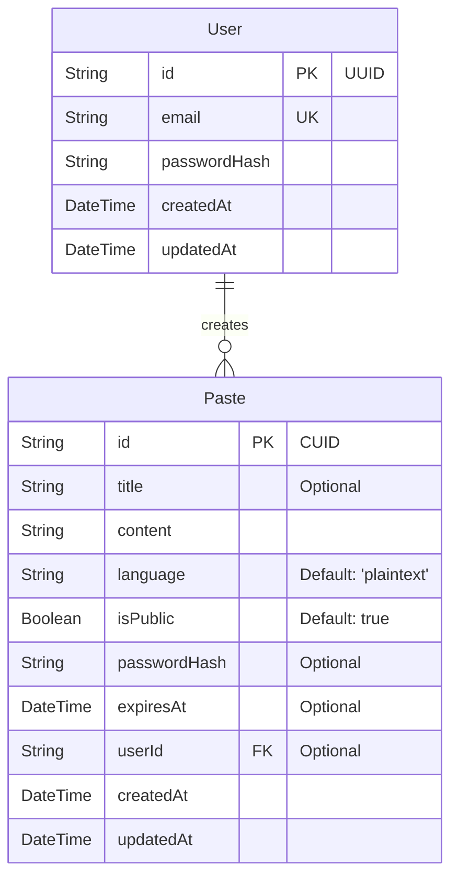

# Database Architecture & Schema

## Entity Relationship (ER) Diagram

## Table Specifications

### 1. User Table
Stores user profile credentials.

| Column | Type | Constraints | Description |
|---|---|---|---|
| `id` | `VARCHAR(36)` | `PRIMARY KEY` (UUID) | Unique identifier for users |
| `email` | `VARCHAR(255)` | `UNIQUE`, `NOT NULL` | Registered email address |
| `passwordHash` | `VARCHAR(255)` | `NOT NULL` | Securely hashed user password |
| `createdAt` | `TIMESTAMP` | `DEFAULT CURRENT_TIMESTAMP` | Signup timestamp |
| `updatedAt` | `TIMESTAMP` | `DEFAULT CURRENT_TIMESTAMP` | Last updated timestamp |

### 2. Paste Table
Stores code snippets, highlight details, access restrictions, and validation metadata.

| Column | Type | Constraints | Description |
|---|---|---|---|
| `id` | `VARCHAR(30)` | `PRIMARY KEY` (CUID) | Short/clean slug for urls |
| `title` | `VARCHAR(100)` | `NULL` | Optional name of snippet |
| `content` | `TEXT` | `NOT NULL` | The raw source code/text |
| `language` | `VARCHAR(50)` | `DEFAULT 'plaintext'` | Syntax highlighting language |
| `isPublic` | `BOOLEAN` | `DEFAULT TRUE` | Search index visibility |
| `passwordHash` | `VARCHAR(255)` | `NULL` | Paste access password |
| `expiresAt` | `TIMESTAMP` | `NULL` | Cleanup target timestamp |
| `userId` | `VARCHAR(36)` | `FOREIGN KEY` (User) | Creator references |
| `createdAt` | `TIMESTAMP` | `DEFAULT CURRENT_TIMESTAMP` | Paste upload timestamp |
| `updatedAt` | `TIMESTAMP` | `DEFAULT CURRENT_TIMESTAMP` | Last updated timestamp |

---

## Relation Integrity

### User-Paste (1:N) Relationship
- Each `Paste` can optionally belong to a `User` (represented by `userId` foreign key). If the paste is created anonymously, `userId` will be stored as `null`.
- **Integrity Constraints**: The `userId` references the primary key `id` of the `User` table.
- **On Delete Action**: If a `User` record is deleted, all pastes created by that user are cascade-deleted (`onDelete: Cascade` relation strategy) to prevent orphaned records in the database.

---

## 4. Performance Indexing Strategy

To maintain sub-millisecond query execution speeds under high data volumes, we enforce a strict index placement policy matching common lookup queries:

### 1. Primary Keys (`User.id` and `Paste.id`)
- **Type**: Clustered Unique B-Tree Index (implicit).
- **Reason**: Guarantees unique CUID/UUID addresses, and enables immediate lookups during fetching requests.

### 2. Unique User Emails (`User.email`)
- **Type**: Unique B-Tree Index (implicit via `@unique`).
- **Reason**: Assures email uniqueness during signups, and optimizes verification speed during authentication handshakes.

### 3. Paste Creator Reference (`Paste.userId`)
- **Type**: Explicit B-Tree Index (`@@index([userId])`).
- **Reason**: Speeds up owner lookup queries (e.g. `GET /api/pastes/me`), preventing table-scans during dashboard listings.

### 4. Expiration Sweeps (`Paste.expiresAt`)
- **Type**: Explicit B-Tree Index (`@@index([expiresAt])`).
- **Reason**: Speeds up chronological sweeps checks (identifying and cleaning expired rows), avoiding performance degradation as database records increase.

